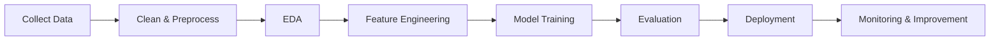

````markdown
<h1 align="center">Hi there, I'm Bilal Ahmed 👋</h1>
<h3 align="center">Data Scientist in Progress | ML & AI Enthusiast | Building Real-World Intelligent Systems</h3>

<p align="center">
  
</p>

<!-- Developer Animation -->
<p align="center">
  
</p>

<p align="center">
  <a href="https://www.linkedin.com/in/bilal-ahmed-56b105248/">
    
  </a>
  <a href="mailto:ahmedbilal988766@gmail.com">
    
  </a>
  <a href="https://www.fiverr.com/bilalahmedd2003/build-machine-learning-models-for-prediction-and-classification-in-python">
    
  </a>
</p>

---

## 🚀 About Me

- 🎓 Computer Science student at **UIT University, Karachi**, specializing in **Data Science & AI**
- 💼 ML Intern at **Developer Hub And Corporation**
- 🔭 Building intelligent systems using **Machine Learning, NLP, Deep Learning & MLOps**
- 🌱 Currently learning **AWS (EC2, S3, Lambda, RDS), Docker and MLOps**
- 💬 Ask me about **Machine Learning, NLP, Python, Data Science and Model Deployment**
- ⚡ I enjoy building complete ML pipelines—from raw data to deployed applications.
- 💼 **Available for Freelance ML Projects on Fiverr**

---

# 🛠️ Featured Projects

<table>
<tr>

<td width="50%" valign="top">

## 🔒 RansomGuard-ML

Behavior-based ransomware detection using **Sysmon logs**, **4-gram feature extraction**, and **Random Forest**, inspired by modern malware detection research.

**Tech**

`Python` `Random Forest` `scikit-learn` `Cyber Security`

</td>

<td width="50%" valign="top">

## 🎬 Movie Recommendation Engine

Content-based recommendation system deployed on **Hugging Face Spaces** with a responsive Streamlit interface.

🔗 https://bilalllahmeddd-movie-recommendation-engine.hf.space

**Tech**

`Python` `Streamlit` `Docker` `scikit-learn`

</td>

</tr>

<tr>

<td width="50%" valign="top">

## 💼 Portfolio Website

Personal portfolio deployed on Render showcasing projects, skills and experience.

🔗 https://bilal-portfolio-nmf0.onrender.com

**Tech**

`Streamlit` `Python` `Render`

</td>

<td width="50%" valign="top">

## 📊 More Projects

Continuously building AI & ML applications.

➡️ https://github.com/Bilall2003?tab=repositories

</td>

</tr>
</table>

---

# 💻 Tech Stack

### Languages


### Machine Learning


### Deployment & Cloud


### Databases & Tools


---

# 📚 Currently Learning

```text
☁️ AWS Cloud
🐳 Docker
⚙️ MLOps
🤖 Deep Learning
🧠 Large Language Models (LLMs)
📦 Production Deployment
```

---

# ⚙️ Development Workflow



---

# 🎯 Current Focus

| 🚀 Building | ☁️ Learning | 💼 Freelancing |
|-------------|-------------|----------------|
| ML Applications | AWS | Prediction Models |
| NLP Projects | Docker | Classification Models |
| Deep Learning | MLOps | Data Analysis |
| Streamlit Apps | CI/CD | Deployment |

---

# 🧩 How I Work

- 🔍 Understand the problem before writing code.
- 📊 Let the data guide every decision.
- ⚙️ Build complete end-to-end ML pipelines.
- 📈 Prioritize explainable and maintainable models.
- 🚀 Deploy solutions so they create real-world value.

---

# 💡 Philosophy

> **"Code. Train. Deploy. Improve. Repeat."**

---

# 🤝 Let's Connect

<p align="center">
  <a href="https://www.linkedin.com/in/bilal-ahmed-56b105248/">
    
  </a>

  <a href="mailto:ahmedbilal988766@gmail.com">
    
  </a>

  <a href="https://www.fiverr.com/bilalahmedd2003/build-machine-learning-models-for-prediction-and-classification-in-python">
    
  </a>
</p>

<p align="center">
<i>Open to internships, freelance opportunities, and collaborations in AI, Machine Learning, and Data Science.</i>
</p>

<p align="center">
  
</p>
````
